# Receipter

### It is a simple app that will help you make your invoices

## Home Screen

- The home screen has the name of the shop which can be edited by clicking the edit button on top right corner of the screen
- You can add the address of the shop.
  <!-- 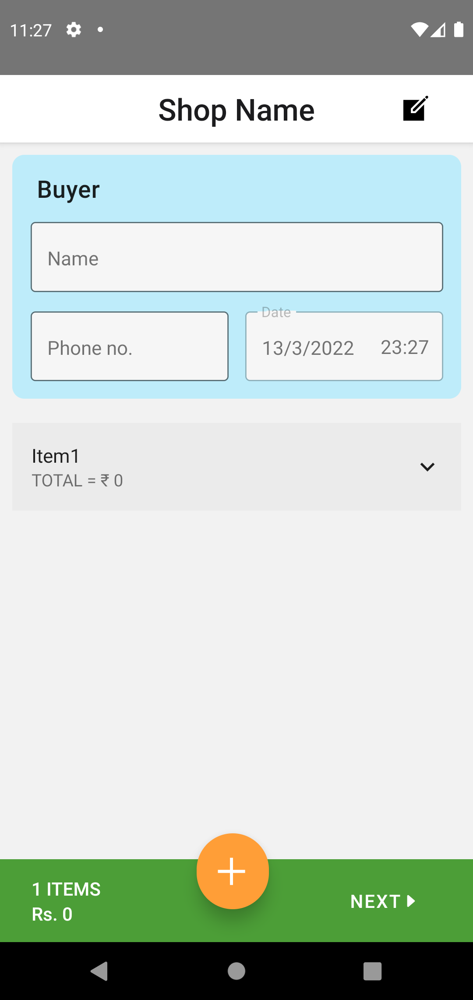 -->
  
  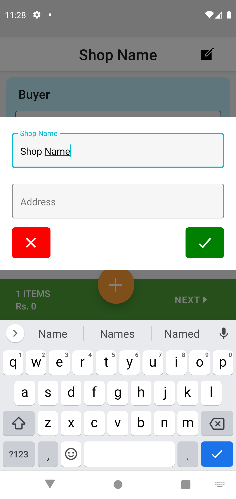
- Now enter the name and phone number of the buyer.
- The date is already the current date, but if you want to change it, click on the date to change it.
   
  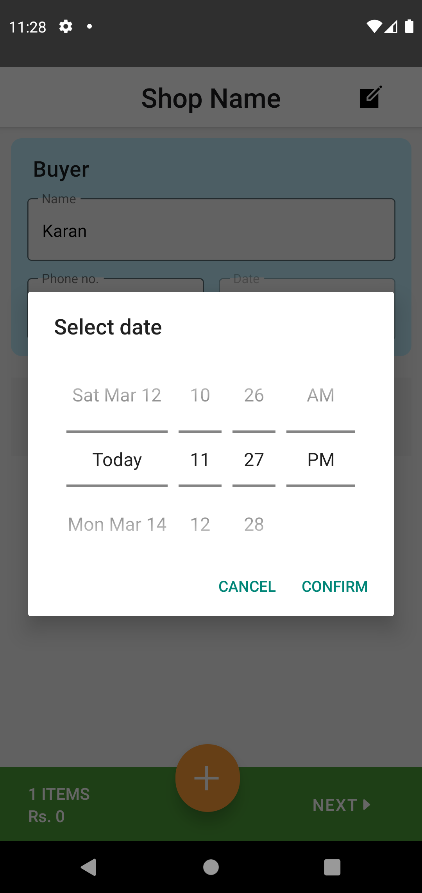
- Now enter the name of the product, price of the product and other details.
- To add new item click the add button on the bottom
 

  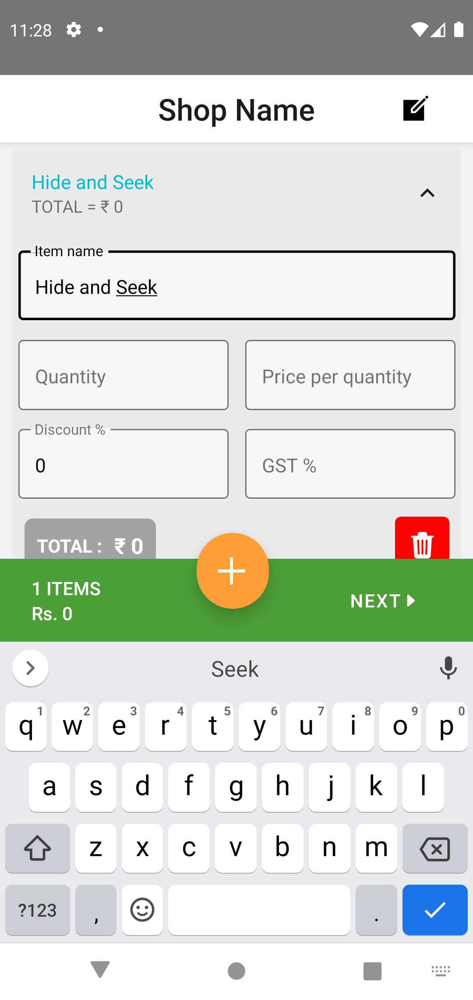
  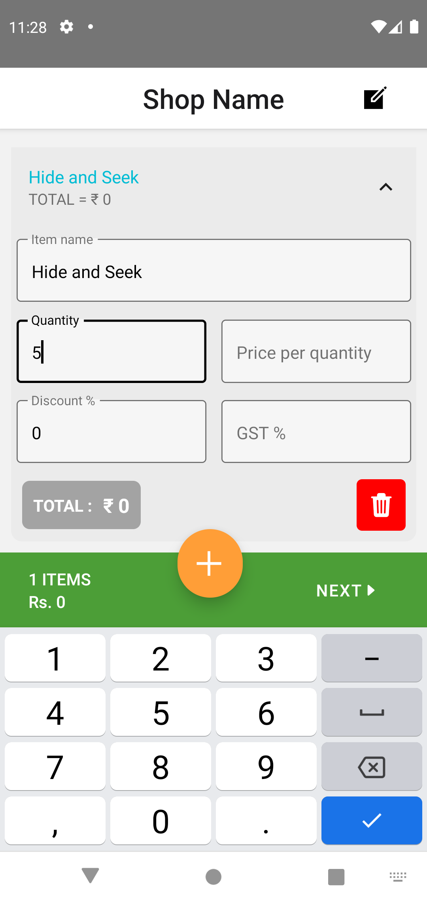
  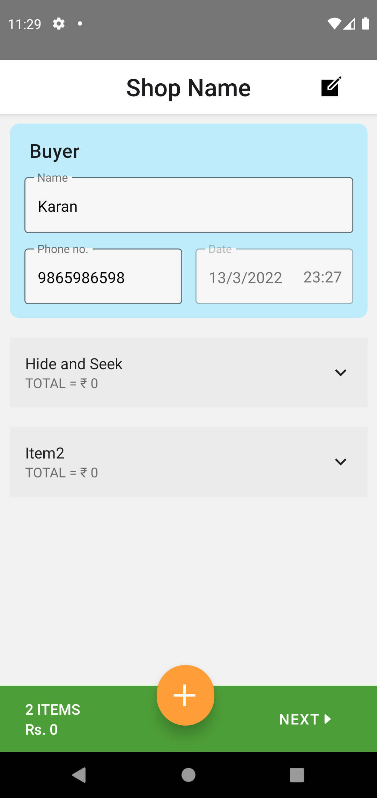

- After fillig all the details, click on the next button to generate the invoice.
 

  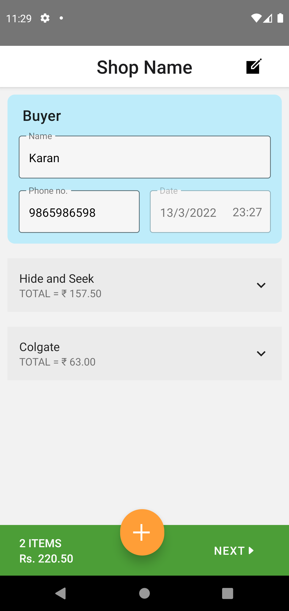

- You can edit the invoice if you want by going back to the home screen
 

  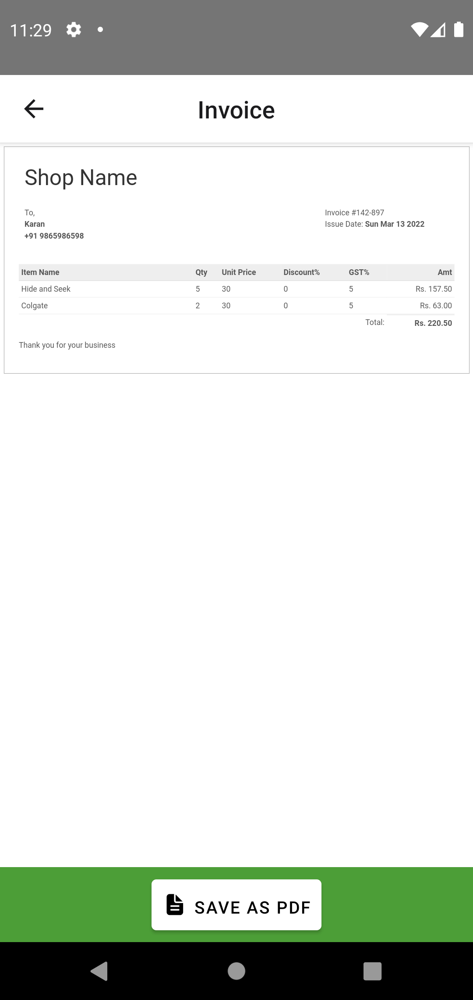
  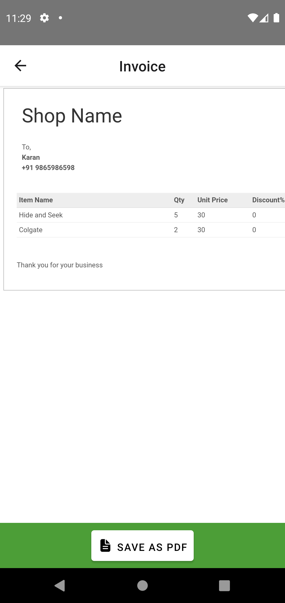

- To save the pdf of the invoice, click on the **SAVE AS PDF** button on bottom bar.
  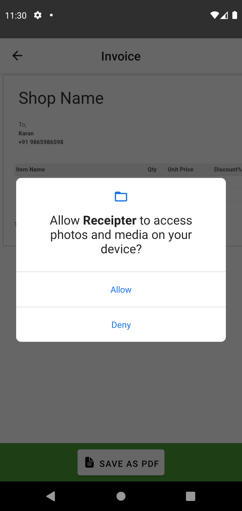
  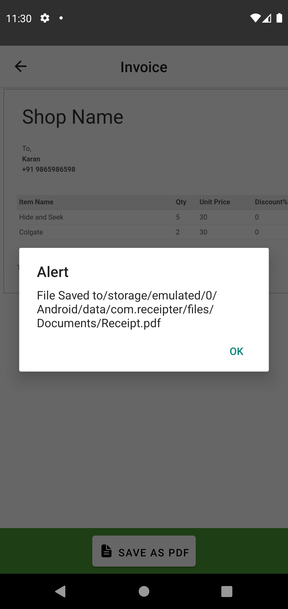
